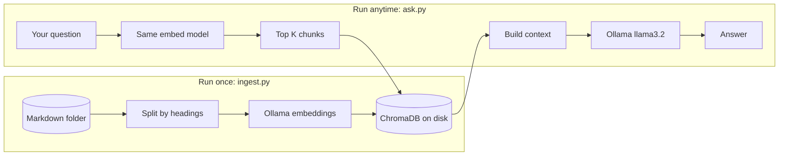
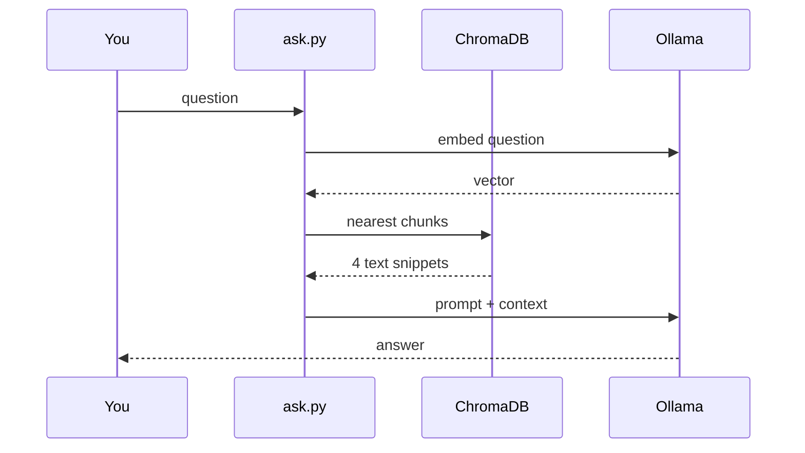

Cloud chatbots are easy to demo and hard to trust with internal notes. **RAG** means **Retrieval Augmented Generation**: before the model answers, you fetch a few relevant chunks from *your* files and pass them as context.

**Ollama** runs open models on your machine (Llama, Mistral, and others). **ChromaDB** is a small local vector database—it stores embeddings and finds similar text.

This tutorial is **Python 3** only. You build two scripts:

| File | Role |
|------|------|
| `ingest.py` | Read Markdown files → chunks → embeddings → Chroma |
| `ask.py` | Your question → retrieve chunks → Ollama answer |

Each file is built in **parts (A, B, …)** below, plus a **full copy-paste** version at the end. You also need **bash** to install Ollama and Python packages.

Works on Linux or macOS. You do not need Cursor, Claude, or Codex to follow along—but the same corpus is useful later if you expose it through [MCP](/posts/mcp-bigquery-server-python-english/) or another tool.


*Pipeline overview: `ingest.py` builds the index once; `ask.py` retrieves chunks and calls Ollama whenever you have a question.*

## How the pipeline fits together

Two steps, two scripts. You run **`ingest.py` once** (or again when files change). You run **`ask.py`** whenever you have a question.



**Ingest** = write the index. **Ask** = search the index, then generate an answer. No API keys either way—Ollama listens on `localhost:11434`.



## RAG vs chatting without your files

A plain LLM has no access to your notes—it guesses from training data. RAG retrieves snippets first, then answers from that context.


<details>
<summary><strong>Example prompt sent to Ollama (after retrieval)</strong></summary>

```text
Answer using only the context below. If the answer is not there, say so.

Context:
[runbook.md › Rollback]
...chunk text...

Question: What is our deploy rollback step?
```

The `ask()` function in Part B builds this string automatically from the top `TOP_K` chunks.

</details>

## Before you start

1. **Python 3.10+** — check with `python3 --version`.
2. **Ollama** — install from [ollama.com](https://ollama.com), then pull two models:

```bash
ollama pull nomic-embed-text
ollama pull llama3.2
```

3. A folder with **Markdown** files (`.md`). Example: copy a few `_posts/` from this site into `./docs_corpus/`.

Install Python libraries:

```bash
pip install chromadb httpx
```

Create two empty files:

```text
ingest.py
ask.py
```

---

## `ingest.py` — Part A: settings

```python
# ingest.py — Python 3
import os
import re
from pathlib import Path

import chromadb
import httpx

CORPUS_DIR = Path("./docs_corpus")
CHROMA_DIR = "./chroma_store"
COLLECTION = "my_docs"
EMBED_MODEL = "nomic-embed-text"
OLLAMA_URL = "http://localhost:11434"
CHUNK_SIZE = 1000
```

Point `CORPUS_DIR` at your Markdown folder.


---

## `ingest.py` — Part B: split Markdown into chunks

Code blocks should stay in one piece when possible. This simple splitter breaks on headings, then on character length.

```python
def split_markdown(text):
    parts = []
    current_heading = "intro"
    buffer = []

    for line in text.splitlines():
        if line.startswith("#"):
            if buffer:
                parts.append((current_heading, "\n".join(buffer).strip()))
                buffer = []
            current_heading = line.lstrip("#").strip()
        else:
            buffer.append(line)

    if buffer:
        parts.append((current_heading, "\n".join(buffer).strip()))

    chunks = []
    for heading, body in parts:
        if not body:
            continue
        for i in range(0, len(body), CHUNK_SIZE):
            piece = body[i : i + CHUNK_SIZE]
            chunks.append({"heading": heading, "text": piece})
    return chunks
```

---

## `ingest.py` — Part C: embeddings through Ollama

```python
def embed(text):
    r = httpx.post(
        f"{OLLAMA_URL}/api/embeddings",
        json={"model": EMBED_MODEL, "prompt": text},
        timeout=120.0,
    )
    r.raise_for_status()
    return r.json()["embedding"]
```

---

## `ingest.py` — Part D: load files into Chroma

```python
def ingest():
    client = chromadb.PersistentClient(path=CHROMA_DIR)
    col = client.get_or_create_collection(COLLECTION)

    ids, documents, metadatas, embeddings = [], [], [], []
    n = 0

    for path in CORPUS_DIR.glob("**/*.md"):
        text = path.read_text(encoding="utf-8")
        for chunk in split_markdown(text):
            n += 1
            doc_id = f"{path.stem}-{n}"
            ids.append(doc_id)
            documents.append(chunk["text"])
            metadatas.append({"file": path.name, "heading": chunk["heading"]})
            embeddings.append(embed(chunk["text"]))
            print(f"Indexed {doc_id}")

    col.upsert(ids=ids, documents=documents, metadatas=metadatas, embeddings=embeddings)
    print(f"Done. {len(ids)} chunks in {CHROMA_DIR}")


if __name__ == "__main__":
    ingest()
```

Run once when your corpus changes:

```bash
python3 ingest.py
```

---

## `ask.py` — Part A: settings (same paths as ingest)

```python
# ask.py — Python 3
import httpx
import chromadb

CHROMA_DIR = "./chroma_store"
COLLECTION = "my_docs"
EMBED_MODEL = "nomic-embed-text"
CHAT_MODEL = "llama3.2"
OLLAMA_URL = "http://localhost:11434"
TOP_K = 4
```

---

## `ask.py` — Part B: retrieve + ask Ollama

```python
def embed(text):
    r = httpx.post(
        f"{OLLAMA_URL}/api/embeddings",
        json={"model": EMBED_MODEL, "prompt": text},
        timeout=120.0,
    )
    r.raise_for_status()
    return r.json()["embedding"]


def retrieve(question):
    client = chromadb.PersistentClient(path=CHROMA_DIR)
    col = client.get_collection(COLLECTION)
    q_vec = embed(question)
    result = col.query(query_embeddings=[q_vec], n_results=TOP_K)
    chunks = []
    for doc, meta in zip(result["documents"][0], result["metadatas"][0]):
        chunks.append(f"[{meta['file']} › {meta['heading']}]\n{doc}")
    return chunks


def ask(question):
    chunks = retrieve(question)
    context = "\n\n---\n\n".join(chunks)
    prompt = f"""Answer using only the context below. If the answer is not there, say so.

Context:
{context}

Question: {question}
"""
    r = httpx.post(
        f"{OLLAMA_URL}/api/generate",
        json={"model": CHAT_MODEL, "prompt": prompt, "stream": False},
        timeout=180.0,
    )
    r.raise_for_status()
    return r.json()["response"]


if __name__ == "__main__":
    q = input("Question: ")
    print(ask(q))
```

Try it:

```bash
python3 ask.py
```

---

## Full `ingest.py` (copy-paste)

```python
# ingest.py — Python 3
from pathlib import Path

import chromadb
import httpx

CORPUS_DIR = Path("./docs_corpus")
CHROMA_DIR = "./chroma_store"
COLLECTION = "my_docs"
EMBED_MODEL = "nomic-embed-text"
OLLAMA_URL = "http://localhost:11434"
CHUNK_SIZE = 1000


def split_markdown(text):
    parts = []
    current_heading = "intro"
    buffer = []
    for line in text.splitlines():
        if line.startswith("#"):
            if buffer:
                parts.append((current_heading, "\n".join(buffer).strip()))
                buffer = []
            current_heading = line.lstrip("#").strip()
        else:
            buffer.append(line)
    if buffer:
        parts.append((current_heading, "\n".join(buffer).strip()))
    chunks = []
    for heading, body in parts:
        if not body:
            continue
        for i in range(0, len(body), CHUNK_SIZE):
            chunks.append({"heading": heading, "text": body[i : i + CHUNK_SIZE]})
    return chunks


def embed(text):
    r = httpx.post(
        f"{OLLAMA_URL}/api/embeddings",
        json={"model": EMBED_MODEL, "prompt": text},
        timeout=120.0,
    )
    r.raise_for_status()
    return r.json()["embedding"]


def ingest():
    client = chromadb.PersistentClient(path=CHROMA_DIR)
    col = client.get_or_create_collection(COLLECTION)
    ids, documents, metadatas, embeddings = [], [], [], []
    n = 0
    for path in CORPUS_DIR.glob("**/*.md"):
        text = path.read_text(encoding="utf-8")
        for chunk in split_markdown(text):
            n += 1
            doc_id = f"{path.stem}-{n}"
            ids.append(doc_id)
            documents.append(chunk["text"])
            metadatas.append({"file": path.name, "heading": chunk["heading"]})
            embeddings.append(embed(chunk["text"]))
            print(f"Indexed {doc_id}")
    col.upsert(ids=ids, documents=documents, metadatas=metadatas, embeddings=embeddings)
    print(f"Done. {len(ids)} chunks.")


if __name__ == "__main__":
    ingest()
```

---

## Full `ask.py` (copy-paste)

```python
# ask.py — Python 3
import httpx
import chromadb

CHROMA_DIR = "./chroma_store"
COLLECTION = "my_docs"
EMBED_MODEL = "nomic-embed-text"
CHAT_MODEL = "llama3.2"
OLLAMA_URL = "http://localhost:11434"
TOP_K = 4


def embed(text):
    r = httpx.post(
        f"{OLLAMA_URL}/api/embeddings",
        json={"model": EMBED_MODEL, "prompt": text},
        timeout=120.0,
    )
    r.raise_for_status()
    return r.json()["embedding"]


def retrieve(question):
    client = chromadb.PersistentClient(path=CHROMA_DIR)
    col = client.get_collection(COLLECTION)
    q_vec = embed(question)
    result = col.query(query_embeddings=[q_vec], n_results=TOP_K)
    chunks = []
    for doc, meta in zip(result["documents"][0], result["metadatas"][0]):
        chunks.append(f"[{meta['file']} › {meta['heading']}]\n{doc}")
    return chunks


def ask(question):
    chunks = retrieve(question)
    context = "\n\n---\n\n".join(chunks)
    prompt = f"""Answer using only the context below. If the answer is not there, say so.

Context:
{context}

Question: {question}
"""
    r = httpx.post(
        f"{OLLAMA_URL}/api/generate",
        json={"model": CHAT_MODEL, "prompt": prompt, "stream": False},
        timeout=180.0,
    )
    r.raise_for_status()
    return r.json()["response"]


if __name__ == "__main__":
    q = input("Question: ")
    print(ask(q))
```

---

## Quick sanity check

After `ingest.py`, ask something that is clearly in one file—for example a heading you know exists.

| Knob | Default | When to change |
|------|---------|----------------|
| `CHUNK_SIZE` | 1000 | Smaller (800) if answers miss detail inside long sections |
| `TOP_K` | 4 | Raise to 6 if the answer spans multiple files |
| `CHAT_MODEL` | llama3.2 | Swap for `mistral` or a larger local model if quality is weak |
| `EMBED_MODEL` | nomic-embed-text | Keep the same model in **both** scripts |

<details>
<summary><strong>Troubleshooting</strong></summary>

- **Empty or wrong answers** — re-run `ingest.py` after any corpus change; confirm `ollama list` shows both models.
- **Slow ingest** — normal on CPU; embed one chunk at a time in this tutorial (batching is a later optimization).
- **"Collection not found"** — run `ingest.py` before `ask.py`; check `CHROMA_DIR` matches in both files.
- **Ollama connection error** — ensure `ollama serve` is running (`curl http://localhost:11434`).

</details>

If the answer is still wrong, try smaller `CHUNK_SIZE` (800) or larger `TOP_K` (6).

---

## How this connects to the MCP post

The [BigQuery MCP server](/posts/mcp-bigquery-server-python-english/) gives **Cursor, Claude, or Codex** structured tools against a warehouse. This RAG stack is the offline cousin: private text, local models, no API invoice. You can later wrap `ask()` as an MCP tool if you want both in the same IDE.

## Limits

- Quality depends on chunking and model size—`llama3.2` is fine for experiments, not a guarantee for production compliance.
- Everything runs on your CPU/GPU; large corpora take time at ingest.
- This is not legal or security review—do not index secrets you would not store in plain text.
