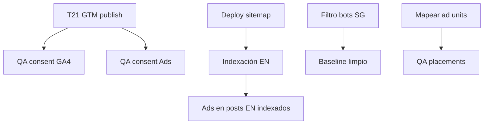

# Horizonte de trabajo — Semana 27 jun – 3 jul 2026

Plan consolidado tras auditorías **GSC**, **GA4** y **AdSense**.  
Informes: [`GSC_AUDIT_2026-06-27.md`](GSC_AUDIT_2026-06-27.md) · [`GA4_AUDIT_2026-06-27.md`](GA4_AUDIT_2026-06-27.md) · [`ADSENSE_AUDIT_2026-06-27.md`](ADSENSE_AUDIT_2026-06-27.md)

---

## Objetivo de la semana

Tener **medición confiable** (consent + GTM), **indexación EN** en marcha, y **monetización alineada** entre código y dashboard AdSense — antes de optimizar contenido o escalar ads.

---

## Vista rápida

| Métrica actual | Valor | Meta semana |
|----------------|-------|-------------|
| Clics orgánicos GSC (28d) | 25 | Mantener + indexar EN |
| Sesiones GA4 (30d) | 185 | Baseline limpio post-filtro bots |
| Bounce GA4 | 84% | Entender (bots vs contenido) |
| Ingresos AdSense (30d) | $0.02 | QA placements OK |
| Tareas totales | **28** | 12 alta · 11 media · 5 baja |

---

## Lunes — Medición y consent (fundación)

Sin esto, el resto de métricas miente.

| ID | Tarea | Tipo | Criterio de hecho |
|----|-------|------|-------------------|
| **T21** | Publish GTM `GTM-K8J9KSB8` con consent en tag GA4 | manual GTM | Container publicado; tag GA4 requiere `analytics_storage` |
| **T25a** | Idem — verificar tag AdSense/ads si existen en GTM | manual GTM | Tags ads requieren `ad_storage` + `ad_user_data` |
| **T25b** | QA consent en incógnito | manual QA | Rechazar → 0 hits GA4 Realtime; Aceptar → hits OK |
| **T26d** | QA ads post-consent | manual QA | Aceptar ads → `adsbygoogle.js` + impresiones en AdSense |
| **T25d** | Asociar GSC ↔ GA4 (`356406631`) | manual GSC | Asociación visible en ambas interfaces |

---

## Martes — Search Console e indexación EN

| ID | Tarea | Tipo | Criterio de hecho |
|----|-------|------|-------------------|
| **T23b** | Deploy + reenviar `sitemap.xml` (post T23) | deploy | Sitemap procesado; URLs ~30–40 (no 73 basura) |
| **T24** | Solicitar indexación URLs EN | manual GSC | 4+ URLs con `/posts/…/` (ver `gsc_index_urls.yml`) |
| **T23d** | Vigilar `isPending` sitemap | manual GSC | `lastDownloaded` actualizado |
| **T23e** | Informe Páginas GSC | manual GSC | Lista de “rastreada no indexada” documentada |
| **T24b** | Internal linking EN → Intelligence | código | Al menos 3 posts EN enlazan al hub |

---

## Miércoles — Calidad de datos GA4

| ID | Tarea | Tipo | Criterio de hecho |
|----|-------|------|-------------------|
| **T25c** | Filtro/exclusión tráfico Singapore | manual GA4 | Filtro de datos interno o informe sin SG |
| **T25e** | Investigar pico 20-jun (22 usuarios) | manual GA4 | Fuente identificada en Explorations |
| **T25f** | Corregir URLs `//` en tracking | código | Sin pagePath `//posts/...` en nuevas sesiones |
| **T25g** | Revisar Enhanced Measurement | manual GA4 | Scroll, outbound, site search ON/OFF documentado |
| **T25i** | Crear segmento “Tráfico humano LATAM” | manual GA4 | Segmento guardado (excl. SG + opcional Direct) |

---

## Jueves — AdSense y monetización

| ID | Tarea | Tipo | Criterio de hecho |
|----|-------|------|-------------------|
| **T26a** | Mapear 6 slot IDs ↔ ad units dashboard | manual AdSense | Tabla slot → unit name documentada |
| **T26b** | Renombrar ad units en AdSense | manual AdSense | Nombres descriptivos (no “horizontal ad”) |
| **T26c** | QA visual cada placement | manual QA | Screenshot/checklist 6 placements en post + home + intelligence |
| **T26e** | Policy center + invalid traffic | manual AdSense | Sin alertas; nota sobre bots SG |
| **T26f** | Evaluar densidad ads (home vs post) | decisión | Decisión: mantener o reducir home_bridge |

---

## Viernes — Cierre, eventos y documentación

| ID | Tarea | Tipo | Criterio de hecho |
|----|-------|------|-------------------|
| **T25h** | Definir 2 eventos custom GA4 | código/GTM | ej. `outbound_click`, `site_search` |
| **T25j** | Snapshot baseline post-fix | docs | Métricas 7d guardadas en BACKLOG |
| **T23f** | Bing Webmaster Tools | manual | Sitio + sitemap enviado |
| **T26g** | Priorizar ads en posts top tráfico | código | Verificar slots en posts con más vistas |
| **T6** | Vision Lab — si hay tiempo | contenido | Entrada real o dejar explícito en backlog |

---

## Aparcamiento (no esta semana)

| ID | Tarea | Motivo |
|----|-------|--------|
| **T3** | Model explorer | Deferred — sin datos reales |
| **T26i** | Auto ads AdSense | Esperar resultado manual units |
| **T27** | Google Ads campañas | No hay cuenta; solo si decides promocionar |
| **T23g** | GSC↔GA4 | Mover a lunes si no se hizo |

---

## Dependencias

---

## Definición de éxito (viernes 3 jul)

- [ ] GTM publicado con consent; QA documentado
- [ ] Sitemap limpio procesado en GSC
- [ ] ≥4 URLs EN solicitadas para indexación
- [ ] Filtro bot Singapore activo en GA4
- [ ] 6 ad slots verificados en dashboard AdSense
- [ ] Baseline métricas 7d anotado en BACKLOG

---

## Changelog del plan

| Fecha | Nota |
|-------|------|
| 2026-06-27 | Plan inicial post-auditorías GSC + GA4 + AdSense |
